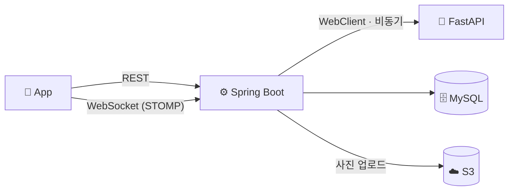
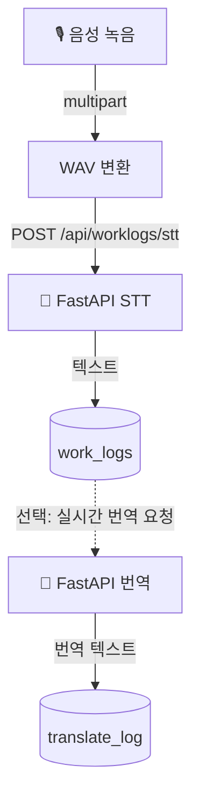
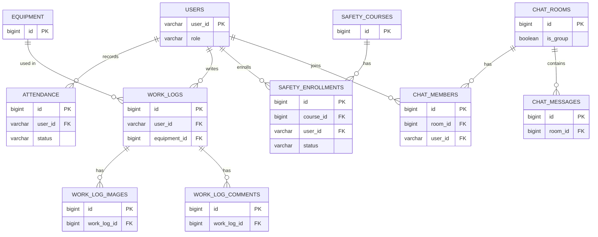

# DOCKin — Backend (Spring)

**현장 노동자를 위한 근태·작업일지·안전교육·실시간 채팅 플랫폼의 Spring 백엔드. Spring과 FastAPI 두 서비스에 걸친 비동기 AI 연동(STT·번역·챗봇)을 붙였고, 실사용 중 만난 채팅 동시쓰기 락 경합을 직접 원인 분석해 고친 이력을 정리했습니다.**

---

## 아키텍처

근태·작업일지·안전교육은 REST로 처리하고, 채팅만 WebSocket(STOMP)으로 별도 연결합니다. FastAPI와의 통신은 전부 `WebClient` 기반 비동기(`Mono`)로 짜여 있습니다.

## 데이터 플로우 — 음성 작업일지

음성 파일은 Spring이 WAV로 변환해 FastAPI로 넘기고, 돌아온 텍스트로 작업일지를 만듭니다. 실시간 번역은 STT 결과에 이어 붙는 별도 요청으로, `Mono.flatMap`으로 체이닝돼 있습니다.

## 주요 테이블

`schema.sql`에는 이 외에 `checklists`/`checklist_items`/`checklist_results`/`absence_requests` 테이블도 정의돼 있지만, 매핑되는 엔티티·서비스·컨트롤러가 없는 죽은 스키마라 위 다이어그램에서는 뺐습니다.

## 대표 API

| Method | Endpoint | 설명 |
| :--- | :--- | :--- |
| `POST` | `/member/login` | 로그인 및 JWT 발급 |
| `POST` | `/api/work-logs/stt` | 음성 파일 기반 작업일지 생성 (STT) |
| `POST` | `/api/ai/rt-translate` | STT 실시간 번역 연동 |
| `POST` | `/api/ai/chatbot` | 현장 안전 가이드 챗봇 |
| `GET` | `/api/work-logs` | 작업일지 목록 조회 (Paging) |
| `POST` | `/api/chat/room` | 채팅방 생성 |
| `GET` | `/api/chat/room/{roomId}/messages` | 채팅 내역 조회 (무한 스크롤) |
| `POST` | `/api/attendance/in` `/out` | 출/퇴근 기록 |
| `PATCH` | `/api/safety/user/training/complete` | 안전교육 이수 완료 처리 |

전체 스펙은 컨트롤러 또는 Swagger에서 확인할 수 있습니다.

---

## 헤드라인 — 채팅 동시 쓰기 락 경합

**문제**: 채팅 메시지 저장(`ChatService.saveMessage`)은 `@Async` + `@Transactional`로 짜여 있었고, 트랜잭션 안에서 `ChatRooms`/`ChatMembers`를 관리 엔티티로 읽어와 setter로 마지막 메시지·마지막 읽음 시간을 갱신하고 있었습니다. 메시지가 여러 스레드에서 동시에 들어오면 같은 `chat_rooms`/`chat_members` 로우를 여러 트랜잭션이 동시에 갱신하려다 락 경합이 났습니다.

**해결**: 마지막 메시지·마지막 읽음 시간 갱신을 `@Modifying` 네이티브 UPDATE 쿼리로 바꿔서 JPA 영속성 컨텍스트와 dirty checking을 거치지 않게 했습니다. 코드에는 이런 주석을 남겼습니다: "여기서 핵심은 room 객체의 필드를 절대 setter로 고치지 않는 것입니다!" 락을 추가로 잡는 대신, JPA가 관리 엔티티를 갱신하면서 락을 걸 상황 자체를 없앤 쪽입니다.

비슷한 시기에 작업일지 삭제 버그도 고쳤습니다. 댓글이 달린 작업일지가 삭제되지 않았는데, `Work_logs`에 `comments` 연관관계(`@OneToMany(cascade=ALL, orphanRemoval=true)`)가 빠져 있어서 Hibernate가 자식 댓글의 존재를 모른 채 부모 삭제를 시도한 게 원인이었습니다. 연관관계를 추가하고 FK를 `ON DELETE CASCADE`로 바꿔서 해결했습니다.

지금도 `saveMessage`는 `@Async`로 선언돼 있는데 로그 문구는 "동기 방식으로 실행"이라고 남아 있습니다. 락 픽스 과정에서 실행 방식이 바뀌었는데 주석·로그를 안 고친 채로 남은 것 같습니다.

---

## 현재 상태 — 알려진 갭

| 축 | 현재 상태 |
| :--- | :--- |
| **인증(리프레시 토큰)** | 🔶 로그인 시 발급·DB 저장까지는 되지만, 이를 소비해 액세스 토큰을 재발급하는 엔드포인트가 없습니다 — 절반만 구현된 상태입니다 |
| **JWT 블랙리스트** | 🔶 `ConcurrentHashMap` 기반 인메모리라 재시작하면 초기화되고, 인스턴스를 늘리면 인스턴스마다 따로 놉니다 |
| **테스트** | 🔴 한때 작업일지·근태·체크리스트 테스트가 있었지만 삭제됐고, 현재는 2개(그중 1개는 컨텍스트 로드용 보일러플레이트)만 남았습니다. CI(`gradlew build -x test`)도 테스트를 건너뜁니다 |
| **스키마 정합성** | 🔶 `ddl-auto=update`와 별도 관리되는 `schema.sql`이 동시에 존재해 스키마 소스가 둘로 갈라질 수 있습니다. 체크리스트·결근신청 테이블은 스키마에만 있고 매핑되는 엔티티가 없습니다 |

---

## 기술 스택

---
